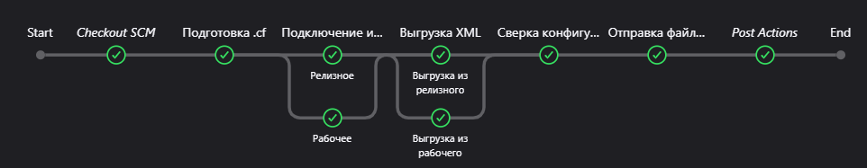

# Используемые технологии

- [Сверка идентификаторов](#Сверка-идентификаторов)

- [Автоматическое тестирование](#Автоматическое-тестирование)

- [Сборка поставки](#Сборка-поставки)
  - [ГРМ](#ГРМ)
  - [AddDocs](#AddDocs)

# Сверка идентификаторов

**Сверка идентификаторов** — процесс экспорта конфигурации в XML-файлы из рабочего и релизного хранилищ с последующим сравнением идентификаторов.

## Файлы

Файлы хранятся в папке `IDENTIFICATOR`:

| Файл                            | Описание                                                                 |
|---------------------------------|--------------------------------------------------------------------------|
| `Jenkinsfile`                   | Основной файл запуска Jenkins.                                           |
| `telegram_file_sender.py`       | Отправляет сообщение с результатами в виде изображения в Telegram.       |
| `configuration_comparison_manager.py` | Формирует таблицу в формате Excel с результатами сверки идентификаторов. |

## Запуск

Процесс полностью автоматизирован. Запуск выполняется через **Jenkins**:
1. Перейдите в раздел **IDENTIFICATOR**.
2. Выберите продукт и нажмите **Собрать**.

Агент выполнения (`master`) находится на сервере 71.

## Принцип работы

1. Подключение к хранилищу и обновление данных.
2. Экспорт конфигурации в XML.
3. Сравнение идентификаторов с использованием расширения.
4. Отправка результатов в Telegram.
5. Очистка рабочего каталога.

## Рабочие каталоги

На сервере 71 в папке `D:\Identificators` хранятся файлы для работы сверки идентификаторов:
- **log**: Логи сборок в формате `xlsx` и сгенерированные изображения для Telegram.
- **Obarabotka**: Обработки для сверки идентификаторов.
- **Rab**: База из рабочего хранилища.
- **Relis**: База из релизного хранилища.

# Автоматическое тестирование

Непрерывное тестирование продукта перед выпуском релиза

## Файлы

Все файлы хранятся в папке `tests`:

- **`Jenkinsfile`** — основной файл запуска Jenkins адаптирован под три продукта. `Фитнес клуб` `Салон красоты` `Стоматология`
- **tools/** — Группа файлов настроек
  - **VAParams.json** — настройки `Vanessa Automation`
- **scripts/** — Группа файлов подготовки и управления базой
  - **AgentRestart.py** — файл рестарта службы Агента сервера `1С`.
  - **drop_db.py** — файл удаления базы из кластера `1С` и `PostgresSQL`
  - **InitDatabase.bat** — файл запуска функций `vrunner`
- **notifications/** — `allure` отчет в `Telegram`
  - **allure-notifications-4.8.0.jar** — исполняющий файл.
  - **config.json** — настройки отчета `allure` и отправка сообщения в `Telegram`
  - **logo.png** — логотип продукта в отчете `allure`
- **features/** — Группы тестов
- **epf/** — обработки
- **cfe/** — расширения
- **build/** — результаты `allure` отчета

## Запуск

**Процесс полностью автоматизирован**.

Запуск производится через **Jenkins**:  

- **fitness**
- **salon**
- **stoma**

Агент выполнения (`OneS`) находится на 71 сервере.  

## Принцип работы

`Pipeline` выполняется автоматически в **`20:00`** по мск. В настройках `Pipeline` продукта который находится в тестировании необходимо включить `Запускать периодически` и указать время выполнения **`H 20 * * *`**

![VERSION_NEW][def3]

### 1. Подготовка базы

- Удаление БД (если она существует)
- Создание новой пустой базы
- Загрузка .dt в новую базу
- Обновление конфигурации базы данных
- Загрузка данных из релизного хранилища
- Обновление конфигурации базы данных

В случае ошибки какого либо из пунктов мы повторяем процедуру еще два раза. При последующей ошибке перезагружается агент севера 1С и повторяем процедуру подготовки базы еще два раза.

При успешном создании и заполненнии базы мы передаём параметр с версией релиза:

- Если версия релиза равна текущей версии в файле `D:\Vanessa-Automation\version`, то продолжаем выполнение `pipeline`
- Если версия релиза больше версии из файла, то мы запускаем процедуру выполнения обработчиков обновления и выгрузки/замены эталонной базы с новой версией

![VERSION_NEW][def2]

### 2. Сценарное тестирование

- Отключение пользователей от базы данных
- Выполнение тестов

### 3. Вывод allure отчета в Telegram

- Проверка резульатат тестирвоания, если стабильно или не стабильно отправляем отчет в `Telegram` в инном случае не отправляем.

### 4. Планируемые этапы

- Дымовые тесты
- syntax-check
- SonarQube

**Рабочие каталоги**

На 71 сервере `D:\Vanessa-Automation` хранятися файлы эталонных баз и версий.

### Этапы выполнения

![Этапы выполнения][def]

### Allure отчет

![Этапы выполнения][def4]

[def]: docs/build.jpg
[def2]: docs/pipeline.jpg
[def3]: docs/trigger.jpg
[def4]: docs/allure.jpg

# Сборка поставки

## AddDocs

## ГРМ

**ГРМ** — сервис 1С, в который необходимо отправить файл `.dt`, полученный из пустой базы актуальной версии релиза.

- Отправка происходит после того, как 1С опубликовали релиз на портале.

### Файлы

Все файлы хранятся в папке `GRM`:

- **`Jenkinsfile`** — основной файл запуска всего процесса отправки в Jenkins.
- **`cleaning.py`** — удаляет содержимое папок `D:\dt` и `D:\cf`.
- **`transfer.py`** — копирует файл `.cf` из папки сборки релизов (`Old_versions_cf`).
- **`upload_file.py`** — выполняет PUT-запрос для отправки файла в ГРМ.

### Принцип работы

1. Удаляется содержимое папок `D:\dt` и `D:\cf`.
2. Получение ссылки предписания.
3. Файл `.cf` переносится из `Old_versions_cf` в `D:\cf`, загружается в пустую базу, обновляется конфигурация, затем выгружается `.dt` в папку `D:\dt`.
4. Файл `.dt` загружается в объектное хранилище.
5. Устанавливается версия по умолчанию.

### Запуск

**Временно!** Актуальный `.cf` файл должен находится по этому пути - > `D:\release_build\FITNESSCORP\Old_versions_cf`

**Процесс полностью автоматизирован**.

Запуск производится через **Jenkins**:  
**Сборки релизов → GRM → Собрать с параметрами**.
Агент выполнения (`OneS`) находится на 71 сервере.  

### Параметры запуска

- **`nameProduct`** — указывается в зависимости от продукта, который отправляем (`finessCorp`, `SpaSalon3`, `salon30`).
- **`version`** — устанавливаем версию в формате `x.x.xx.x`.
- **`jenkinsAgent`** — имя агента устанавливается по умолчанию (изменять не нужно).

---
