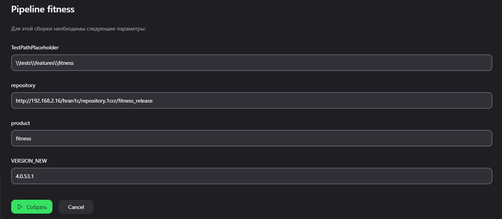
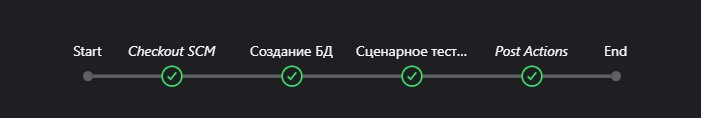

<h1>Покрытие тестов</h1>

<h3>1С: Фитнес-клуб</h3>

<svg width="600" height="300" xmlns="http://www.w3.org/2000/svg" viewBox="0 0 600 300">
  <!-- Пример простой принципиальной схемы: батарея → выключатель → резистор → светодиод → GND -->

  <!-- Батарея (+) -->
  <circle cx="50" cy="150" r="10" fill="none" stroke="black" stroke-width="4"/>
  <line x1="50" y1="100" x2="50" y2="200" stroke="black" stroke-width="4"/>
  <line x1="70" y1="110" x2="70" y2="190" stroke="black" stroke-width="8"/>
  <line x1="90" y1="120" x2="90" y2="180" stroke="black" stroke-width="4"/>

  <!-- Соединение -->
  <line x1="90" y1="150" x2="150" y2="150" stroke="black" stroke-width="4"/>

  <!-- Выключатель -->
  <line x1="150" y1="150" x2="180" y2="150" stroke="black" stroke-width="4"/>
  <line x1="180" y1="150" x2="210" y2="120" stroke="black" stroke-width="4"/> <!-- открытый выключатель -->
  <circle cx="195" cy="135" r="8" fill="white" stroke="black" stroke-width="3"/>

  <!-- Соединение -->
  <line x1="210" y1="120" x2="240" y2="150" stroke="black" stroke-width="4"/>
  <line x1="240" y1="150" x2="300" y2="150" stroke="black" stroke-width="4"/>

  <!-- Резистор -->
  <rect x="300" y="130" width="100" height="40" fill="none" stroke="black" stroke-width="4" rx="5"/>
  <text x="350" y="155" font-size="16" text-anchor="middle" dominant-baseline="middle">R 220Ω</text>

  <!-- Соединение -->
  <line x1="400" y1="150" x2="460" y2="150" stroke="black" stroke-width="4"/>

  <!-- Светодиод -->
  <polygon points="460,150 490,130 490,170" fill="none" stroke="black" stroke-width="4"/>
  <line x1="490" y1="130" x2="490" y2="170" stroke="black" stroke-width="4"/>
  <line x1="485" y1="140" x2="495" y2="140" stroke="black" stroke-width="4"/>
  <line x1="485" y1="160" x2="495" y2="160" stroke="black" stroke-width="4"/>
  <line x1="495" y1="135" x2="505" y2="145" stroke="black" stroke-width="4"/>
  <line x1="495" y1="165" x2="505" y2="155" stroke="black" stroke-width="4"/>
  <text x="475" y="180" font-size="16">LED</text>

  <!-- GND -->
  <line x1="505" y1="150" x2="550" y2="150" stroke="black" stroke-width="4"/>
  <line x1="550" y1="150" x2="550" y2="200" stroke="black" stroke-width="4"/>
  <line x1="520" y1="200" x2="580" y2="200" stroke="black" stroke-width="4"/>
  <line x1="530" y1="190" x2="570" y2="190" stroke="black" stroke-width="4"/>
  <line x1="540" y1="180" x2="560" y2="180" stroke="black" stroke-width="4"/>

  <!-- Подписи -->
  <text x="50" y="80" font-size="18" text-anchor="middle">+9V</text>
  <text x="550" y="230" font-size="18" text-anchor="middle">GND</text>
</svg>

<h3>1С: Стоматологическая клиника</h3>

<h3>1С: Салон красоты</h3>

<h1>Автоматическое тестирование </h1>

Автоматическое тестирование продукта перед выпуском релиза для обеспечения качества.

## Файлы

Файлы хранятся в папке `tests`:

| Папка/Файл                        | Описание                                                                 |
|-----------------------------------|--------------------------------------------------------------------------|
| `Jenkinsfile`                     | Основной файл запуска Jenkins, адаптированный для трёх продуктов: «Фитнес-клуб», «Салон красоты», «Стоматология». |
| `tools/VAParams.json`             | Настройки для Vanessa Automation.                                        |
| `scripts/AgentRestart.py`         | Перезапускает службу агента сервера 1С.                                 |
| `scripts/drop_db.py`              | Удаляет базу данных из кластера 1С и PostgreSQL.                         |
| `scripts/InitDatabase.bat`        | Запускает функции `vrunner` для инициализации базы.                      |
| `notifications/allure-notifications-4.8.0.jar` | Формирует отчёт Allure и отправляет его в Telegram.                     |
| `notifications/config.json`        | Настройки отчёта Allure и отправки сообщений в Telegram.                 |
| `notifications/logo.png`           | Логотип продукта в отчёте Allure.                                       |
| `features/`                       | Наборы тестов для Vanessa Automation.                                   |
| `epf/`                            | Обработки для тестирования.                                             |
| `cfe/`                            | Расширения конфигурации.                                                |
| `build/`                          | Результаты отчётов Allure.                                              |

## Запуск

Процесс полностью автоматизирован. Запуск выполняется через **Jenkins** для продуктов:

- **fitness** (Фитнес-клуб)
- **salon** (Салон красоты)
- **stoma** (Стоматология)

Агент выполнения (`OneS`) находится на сервере 71.

### Настройка расписания

Тестирование выполняется автоматически в **20:00** по МСК. Для активации периодического запуска в настройках Pipeline продукта включите опцию «Запускать периодически» и укажите расписание: `H 20 * * *`.

## Принцип работы

### 1. Подготовка базы данных

1. Удаление существующей базы данных (при её наличии).
2. Создание новой пустой базы.
3. Загрузка файла `.dt` в новую базу.
4. Обновление конфигурации базы данных.
5. Загрузка данных из релизного хранилища.
6. Повторное обновление конфигурации.

В случае ошибки на любом этапе процесс повторяется до двух раз. При повторной ошибке перезапускается агент сервера 1С, после чего подготовка базы повторяется ещё два раза.

Если база успешно создана и заполнена, проверяется версия релиза:

- Если версия совпадает с текущей в файле `D:\Vanessa-Automation\version`, продолжается выполнение Pipeline.
- Если версия релиза выше, запускаются обработчики обновления, а эталонная база выгружается и заменяется новой версией.

### 2. Сценарное тестирование

1. Отключение пользователей от базы данных.
2. Выполнение тестов с использованием Vanessa Automation.

### 3. Формирование и отправка отчёта Allure

- Проверяется стабильность результатов тестирования.
- Если результат стабилен или нестабилен, отчёт Allure отправляется в Telegram.
- В противном случае отчёт не отправляется.

### 4. Дымовые тесты

#### - **Планируемые этапы**

- **Syntax-check**: Автоматическая проверка синтаксиса кода.
- **SonarQube**: Анализ качества кода с использованием платформы SonarQube.

## Рабочие каталоги

На сервере 71 в папке `D:\Vanessa-Automation` хранятся файлы эталонных баз и информация о версиях.

